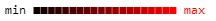
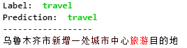
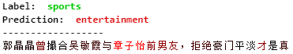

# Transformer Viewer
Simple visualization for pytorch model, Test version for classification task  
Implementation of paper:   [Axiomatic Attribution for Deep Networks](https://arxiv.org/abs/1703.01365)

## Requirments:
* python > 3.6  
* pytorch > 1.4  
* Colr > 0.9  

## Installation:
    pip install transformer_viewer

## How to use:
```python
import numpy as np
import torch
import json

from transformers import *
from transformer_viewer import Glimpse


# Load dict
with open(PATH_ID2LABEL) as infile: idx_label_map = json.load(infile)

# Load model
if torch.cuda.is_available():
    device = torch.device('cuda')
else:
    device = torch.device('cpu')
        
tokenizer = BertTokenizer.from_pretrained(MODEL_PATH)
model = BertForSequenceClassification.from_pretrained(MODEL_PATH, num_labels=len(idx_label_map))

def adaptor_embed(model, sign):
    if sign == 'value':
        return model.bert.embeddings.word_embeddings.weight.data
    elif sign == 'grad':
        return model.bert.embeddings.word_embeddings.weight.grad
    else:
        pass

def adaptor_model(text, model, tokenizer, device, label=None):
    _input = tokenizer(
                  text = text,
                  add_special_tokens=True,
                  return_tensors="pt"
             )
    _input.to(device=device)
    

    if label is None:
        with torch.no_grad():
            outputs = model(**_input)

            logits = outputs[0]
            logits = logits.cpu().detach().numpy()

            label_id = np.argmax(logits, axis=1)

            return _input["input_ids"], label_id
    else:
        _input["labels"] = torch.tensor(label).to(device, dtype=torch.long)

        outputs = model(**_input)
        loss = outputs[0]

        return loss

viewer = Glimpse(model, tokenizer, adaptor_embed, adaptor_model, device, spliter=' ', id2label=idx_label_map)

viewer.color_bar()
```


```python
viewer.view("乌鲁木齐市 新增 一处 城市 中心 旅游 目的地", "travel")
```

```python
viewer.view("郭晶晶 曾 撮合 吴敏霞 与 章子怡 前男友 ， 拒绝 豪门 平淡 才 是 真", "sports")
```


## Parameters:
### Glimplse(model, tokenizer, adaptor_embed, adaptor_model, device, spliter=' ', id2label=None, step=20)
parameter|type|description|example
---|:--:|:--:|---:
model|object|pytorch model|Bert
tokenizer|transformers tokenizer||BertTokenizer
adaptor_embed|func|extract embedding and grad|see example
adaptor_model|func|output loss target and label from different model|see example
device|torch device||see example
spliter|str|how to connect tokens|' ' for english " for chinese
id2label|dict|mapping from id to label|{0:'sports'}

### view(text, label)
parameter|type|description|example
---|:--:|:--:|---:
text|str|input text|'我 爱 中国'
label|int or str||'car'
